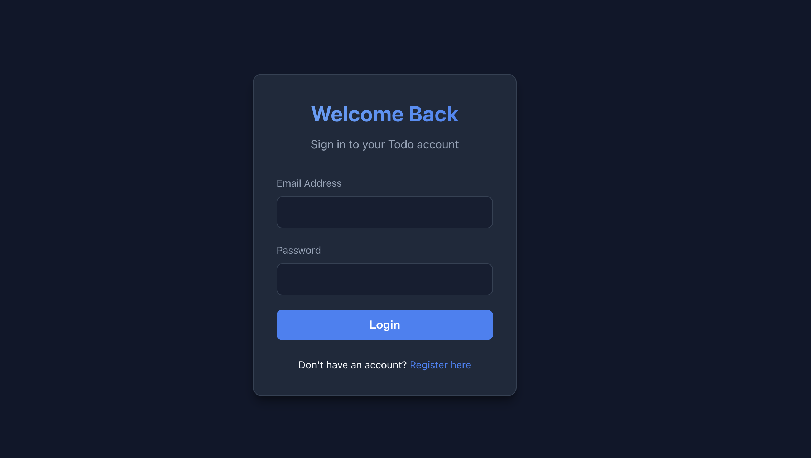
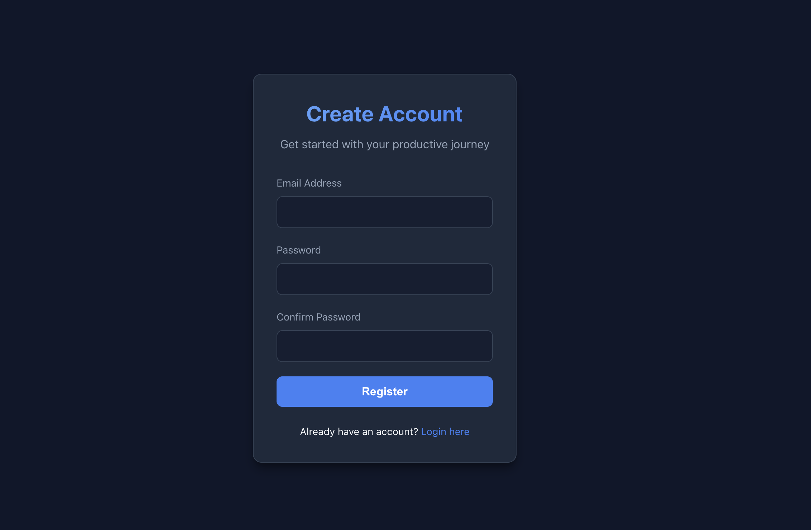
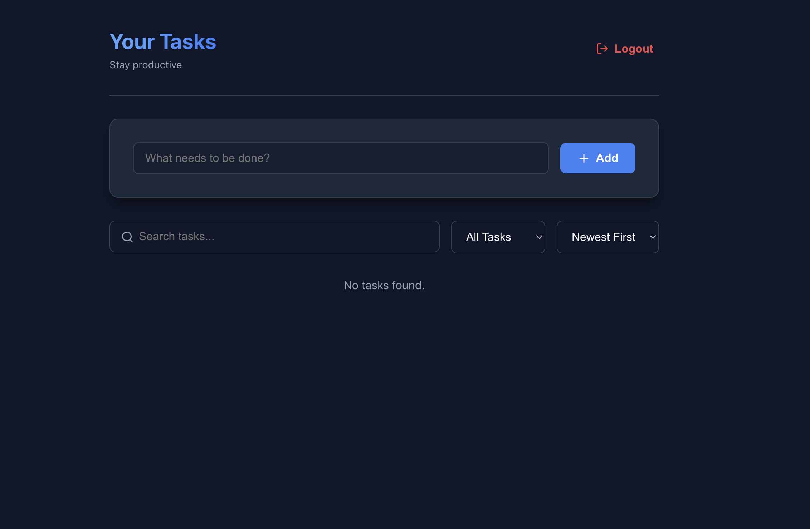
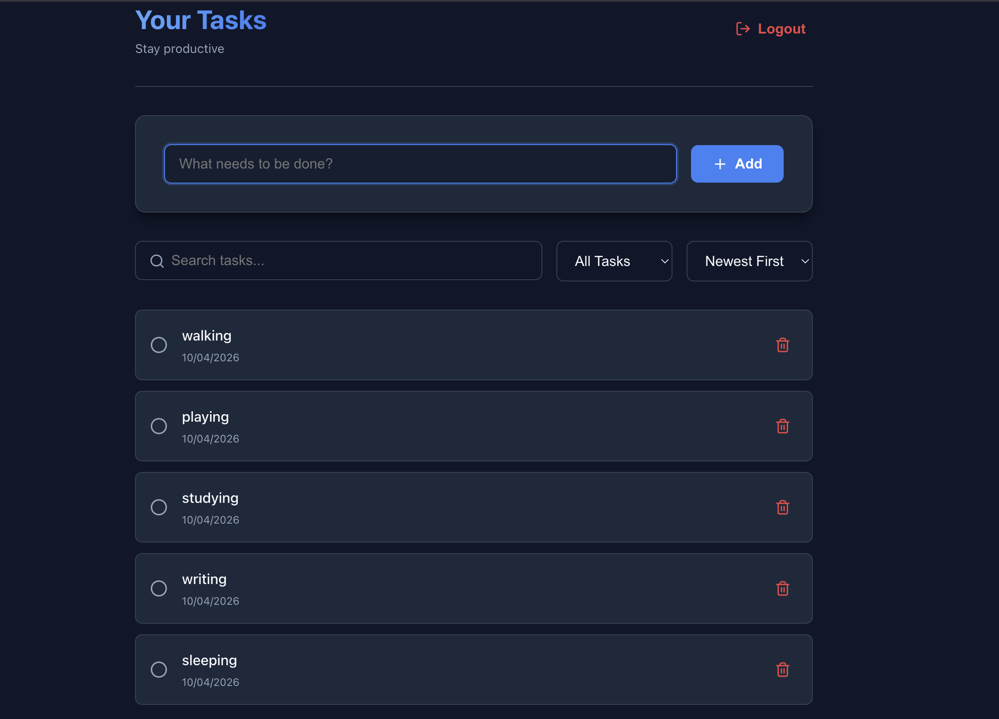

# Full Stack Todo Application

## Objective
A complete, production-ready Full Stack Todo application showcasing clean architecture, modern UI design, and robust backend practices. This project was built to demonstrate proficiency in connecting a scalable Node.js backend with a dynamic React frontend.

## Description
This application allows users to securely register and log into their personal workspaces. Once authenticated, users can create, read, update, and delete their daily tasks. The app features a beautiful dark-mode interface with dynamic UI states, seamless API integrations, and JSON Web Token (JWT) based security.

## Features
- **Secure Authentication:** User registration and login utilizing hashed passwords and JWT.
- **Task Management (CRUD):** Fully functional Create, Read, Update, and Delete operations for tasks.
- **Advanced Filtering & Sorting:** Search tasks by title, filter active/completed statuses, and sort chronologically. 
- **Modern UI/UX:** Responsive design, glassmorphism elements, CSS variables, and Lucide React iconography.
- **Protected Routing:** Prevents unauthenticated users from accessing the dashboard.

## Tech Stack
- **Frontend:** React, Vite, React Router DOM, Axios, Lucide React
- **Backend:** Node.js, Express.js
- **Database:** MongoDB (Mongoose Schema Modeling)
- **Security:** bcryptjs (password hashing), jsonwebtoken (auth payloads), cors

## Setup Instructions

### 1. Database Setup
Ensure you have a MongoDB instance running (local or MongoDB Atlas). Update the connection string accordingly.

### 2. Backend Setup
```bash
cd backend
npm install
cp .env.example .env
# Edit .env with your MONGO_URI and JWT_SECRET
npm run dev
```
The backend server runs via `nodemon` on `http://localhost:4000`.

### 3. Frontend Setup
```bash
cd frontend
npm install
npm run dev
```
The frontend Vite server will be accessible at `http://localhost:5173`. Ensure your `VITE_API_URL` environment variable points to the backend!

## API Endpoints
| Method | Endpoint | Description | Requires Auth |
|---|---|---|---|
| POST | `/api/auth/register` | Register a new user | No |
| POST | `/api/auth/login` | Authenticate & acquire JWT token | No |
| GET | `/api/tasks` | Fetch all user tasks | Yes |
| POST | `/api/tasks` | Create a new task | Yes |
| PUT | `/api/tasks/:id` | Update task status or title | Yes |
| DELETE | `/api/tasks/:id` | Delete a specific task | Yes |
| GET | `/health` | Healthcheck for hosting platforms | No |

## Screenshots

Below is a look at the application in action:

### Login Interface


### Registration Interface


### Main Dashboard


### Adding a Task


## Challenges Faced & Solutions
- **Port Conflicts on macOS:** Encountered an issue where the native system AirPlay Receiver secretly occupied port 5000, causing silent connection drops. Quickly migrated the environment configuration over to port 4000.
- **Cross-Origin Resource Sharing (CORS):** Debugging preflight requests to appropriately whitelist the Vite dev server origin dynamically so it aligns properly when eventually pushed securely.
- **State Hydration:** Managing asynchronous JWT lookups in React's `useEffect` hooks cleanly to prevent page flicker before deciding to render the authenticated Dashboard or return the user to Login.
